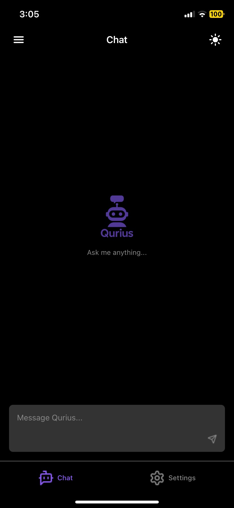
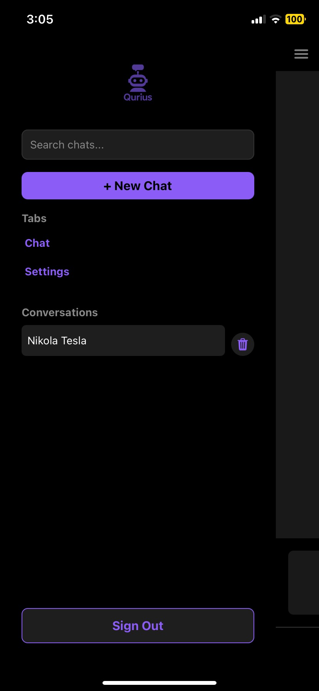
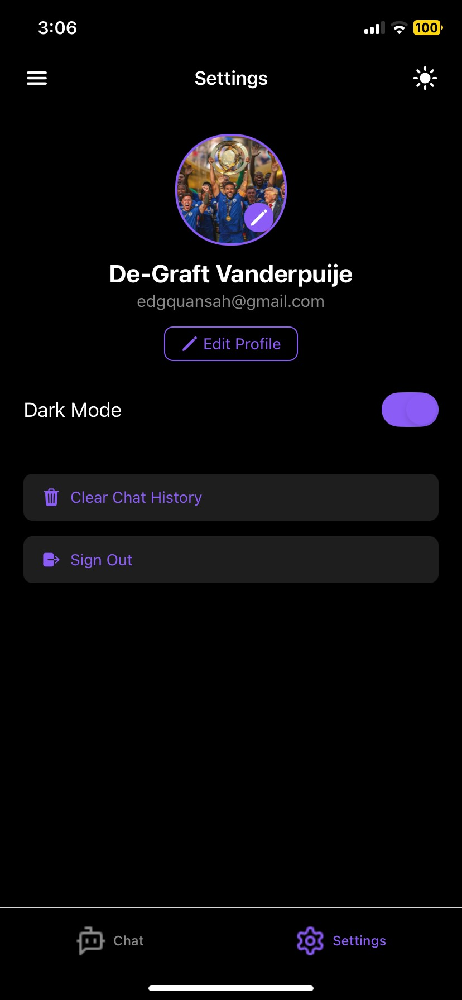

#  Qurius ChatBot 🤖

A beautiful, blazing-fast, mobile-first AI chatbot app built with React Native, Expo, and Supabase.

---

## ✨ Features

- **Conversational AI**: Chat with an intelligent assistant powered by OpenAI's GPT models.
- **Multi-Conversation Support**: Organize your chats into separate conversations, each with its own history and title.
- **Persistent Chat History**: All conversations and messages are stored securely in Supabase, so you never lose your chat history.
- **Authentication**: Secure sign-in and sign-up with Supabase Auth.
- **Profile Management**: Edit your profile, including avatar image upload (with Expo Image Picker and Supabase Storage).
- **Markdown Support**: AI responses are beautifully formatted with Markdown (code, lists, links, etc.).
- **Streaming Responses**: Watch the AI type out its answers in real time, just like a real conversation.
- **Copy on Long Press**: Long-press any message (AI or user) to copy its text instantly.
- **Theme Awareness**: Fully supports light and dark mode, adapting to your device's theme.
- **Mobile-First UI**: Designed for a seamless, modern mobile experience with smooth animations and intuitive gestures.
- **Drawer Navigation**: Professional, theme-aware drawer with search, new chat, and sign out.
- **Error Handling**: Graceful error messages for network/API issues, ensuring a robust user experience.

---

## 🛠️ Tools & Technologies

<div align="center">
  <a href="https://reactnative.dev/" target="_blank">
    
  </a>
  <a href="https://expo.dev/" target="_blank">
    
  </a>
  <a href="https://www.typescriptlang.org/" target="_blank">
    
  </a>
  <a href="https://platform.openai.com/docs/api-reference" target="_blank">
    
  </a>
  <a href="https://supabase.com/" target="_blank">
    
  </a>
  <a href="https://github.com/iamacup/react-native-markdown-display" target="_blank">
    
  </a>
  <a href="https://www.nativewind.dev/" target="_blank">
    
  </a>
  <a href="https://docs.expo.dev/router/introduction/" target="_blank">
    
  </a>
  <a href="https://reactnative.dev/docs/clipboard" target="_blank">
    
  </a>
  <a href="https://docs.expo.dev/versions/latest/sdk/imagepicker/" target="_blank">
    
  </a>
  <a href="https://github.com/" target="_blank">
    
  </a>
</div>

- **[React Native](https://reactnative.dev/)** (with Expo) — cross-platform mobile development  
- **[TypeScript](https://www.typescriptlang.org/)** — for type safety and maintainability  
- **[OpenAI API](https://platform.openai.com/docs/api-reference)** — natural language understanding and generation  
- **[Supabase](https://supabase.com/)** — authentication, database (PostgreSQL), and storage for user profiles, conversations, and messages  
- **[react-native-markdown-display](https://github.com/iamacup/react-native-markdown-display)** — rich markdown rendering  
- **[NativeWind](https://www.nativewind.dev/)** (Tailwind CSS for RN) — rapid, consistent styling  
- **[Expo Router](https://docs.expo.dev/router/introduction/)** — file-based navigation  
- **[Expo Image Picker](https://docs.expo.dev/versions/latest/sdk/imagepicker/)** — for user avatar/profile image upload  
- **Custom Hooks & Context** — for theme and tab bar management  
- **[Clipboard API](https://reactnative.dev/docs/clipboard)** — (optional) for copy-to-clipboard functionality  

---

## 🚀 Strategies & Design Decisions

- **Streaming UI**: Implemented a word-by-word streaming effect for AI responses, creating a natural, engaging chat experience.
- **Touch-Optimized**: All message bubbles are touchable, supporting long-press copy and smooth scrolling.
- **Keyboard Handling**: Animated keyboard-aware input ensures the chat input is always accessible, even with the keyboard open.
- **Separation of Concerns**: Cleanly separated UI, logic, and API calls for maintainability and scalability.
- **Theme Context**: Centralized theme management for instant light/dark mode switching and consistent color usage.
- **Error Handling**: Graceful error messages for network/API issues, ensuring a robust user experience.

---

## 🧩 Problems Solved

- **Non-selectable Markdown**: Added long-press copy for both AI and user messages to work around React Native's markdown selection limitations.
- **Overlapping Bubbles**: Refactored message rendering to prevent AI bubbles from overlapping user messages.
- **Keyboard Overlap**: Used animated views and tab bar height detection to keep the input field visible at all times.
- **Consistent Theming**: Unified color palette and context-driven theming for a polished, professional look.

---

## 📸 Screenshots

<div align="center">
  
  
  
  
  
</div>

---

## 🏁 Getting Started

1. **Install dependencies**
   ```bash
   npm install
   ```
2. **Start the app**
   ```bash
   npx expo start
   ```
3. **Open on your device**
   - Use the Expo Go app, an emulator, or a development build.

---

## 🤝 Contributing

Pull requests are welcome! For major changes, please open an issue first to discuss what you would like to change.

1. Fork the repo
2. Create your feature branch (`git checkout -b feature/YourFeature`)
3. Commit your changes (`git commit -am 'Add new feature'`)
4. Push to the branch (`git push origin feature/YourFeature`)
5. Open a pull request

---

## 📄 License

[MIT](./LICENSE)

---

> _Built using React Native, Expo, and OpenAI._
